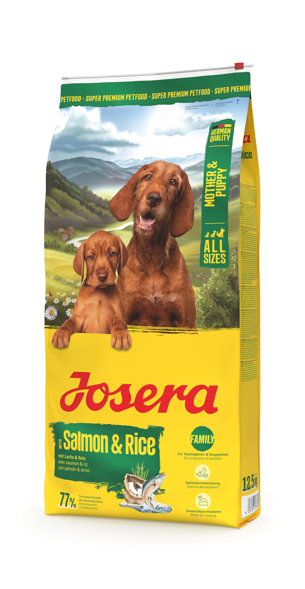

# JOSERA PRODUCT DETAIL PAGE - IMPLEMENTATION GUIDE

## Overview
This guide shows how to link product cards from any category page (shun.html, katu.html, josi.html, bjshkakan.html) to the unified product detail page.

---

## Files Created/Updated

### 1. **product-detail.html** (New)
- Single template for all product details
- Displays product info based on URL parameter: `?id=product_slug`
- Example: `product-detail.html?id=josera_kitten_grainfree`

### 2. **js/data.js** (New)
- Contains `productsData` object with all products
- Each product has: name, type, mini description, full description, packaging, image path
- Organized by category (dog, cat, josi, help products)

### 3. **js/product-detail.js** (New)
- Handles URL parameter extraction
- Populates DOM with product data from `productsData`
- Manages back button navigation

### 4. **katu.html** (Updated)
- Product card links updated to: `product-detail.html?id=josera_kitten_grainfree`
- All 5 cat products now link correctly

### 5. **css/styles.css** (Updated)
- Added `.product-detail-*` classes for layout
- Professional responsive design for product detail page
- Sticky sidebar image on desktop, full-width on mobile

---

## How to Link Products on Other Pages

### Template for Product Card Link

```html
<a class="product-card" href="product-detail.html?id=PRODUCT_ID_HERE">
    <div class="product-card-content">
        <div class="text">
            <h2>Product Name</h2>
            <div class="product-type">Product Type</div>
            <div class="mini-desc">Mini description text</div>
        </div>
        
    </div>
</a>
```

### Product ID Mapping Reference

**DOG PRODUCTS:**
- `josera_family_plus_mother_puppy`
- `josera_surf_turf_junior`
- `josera_kids`
- `josera_sensi_junior`
- `josera_mini_junior`
- `josera_lamb_sweet_potato`
- `josera_duck_sweet_potato`
- `josera_poultry_trout`
- `josera_sensi_adult`
- `josera_lamb_rice`
- `josera_festival`
- `josera_large_breed`
- `josera_mini_lamb`
- `josera_mini_duck_potato`
- `josera_mini_salmon_chicken`

**CAT PRODUCTS:**
- `josera_kitten_grainfree`
- `josera_naturecat`
- `josera_catelux`
- `josera_dailycat`
- `josera_leger`

**JOSI DOG PRODUCTS:**
- `josi_dog_family`
- `josi_dog_junior`
- `josi_dog_mini`
- `josi_dog_active`
- `josi_dog_regular`

**JOSI CAT PRODUCTS:**
- `josi_cat_kitten`
- `josi_cat_sterilised_classic`
- `josi_cat_crispy_duck`
- `josi_cat_tasty_beef`

**HELP/MEDICAL PRODUCTS:**
- `josera_help_urinary_cat`
- `josera_help_renal_cat`
- `josera_help_gastrointestinal_cat`
- `josera_help_hypoallergenic_cat`
- `josera_help_gastrointestinal_dog`
- `josera_help_hypoallergenic_dog`
- `josera_help_renal_dog`
- `josera_help_weight_diabetic_dog`
- `josera_help_liver_dog`

---

## Example: Updating shun.html (Dog Products)

Open **shun.html** and replace product card `href="#"` with proper links:

```html
<!-- BEFORE -->
<a class="product-card" href="#">
    <div class="product-card-content">
        <div class="text">
            <h2>Family Plus Mother & Puppy</h2>
            <div class="product-type">Գերմանական սուպեր պրեմիում դասի կեր</div>
            <div class="mini-desc">Նախատեսված է նորածին ձագերի (1–2 ամսական) համար։</div>
        </div>
        
    </div>
</a>

<!-- AFTER -->
<a class="product-card" href="product-detail.html?id=josera_family_plus_mother_puppy">
    <div class="product-card-content">
        <div class="text">
            <h2>Family Plus Mother & Puppy</h2>
            <div class="product-type">Գերմանական սուպեր պրեմիում դասի կեր</div>
            <div class="mini-desc">Նախատեսված է նորածին ձագերի (1–2 ամսական) համար։</div>
        </div>
        
    </div>
</a>
```

---

## How It Works

1. **User clicks a product card** → Browser navigates to:
   ```
   product-detail.html?id=josera_kitten_grainfree
   ```

2. **product-detail.js runs** and:
   - Extracts `id` parameter from URL
   - Finds product in `productsData` object
   - Populates all DOM elements with product info

3. **Page displays**:
   - Large product image on the right
   - Name, type, and full description on the left
   - Packaging size in a badge
   - Back button to return to previous page

4. **Back button**:
   - Uses `window.history.back()` if available
   - Falls back to `index.html` if no history

---

## Verification Checklist

✅ All product card links point to: `product-detail.html?id=PRODUCT_ID`
✅ Product IDs match keys in `js/data.js` productsData object
✅ Images exist at paths specified in data.js
✅ Product-detail.html, js/data.js, and js/product-detail.js are all present
✅ CSS includes product-detail styles
✅ Tested at least one product link

---

## Notes

- **No backend required**: All data is in `js/data.js`
- **Fully responsive**: Works on desktop, tablet, and mobile
- **SEO friendly**: Each product has unique URL parameter
- **Accessible**: Proper semantic HTML and navigation
- **Easy to maintain**: Add/edit products by updating `js/data.js`

